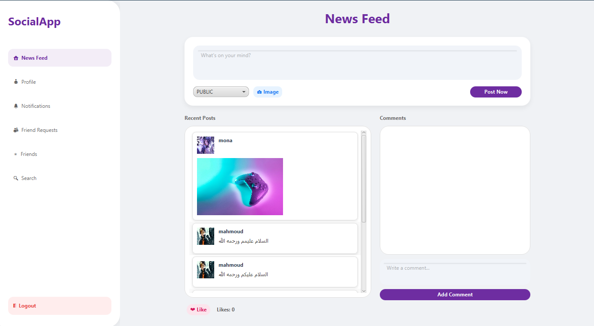
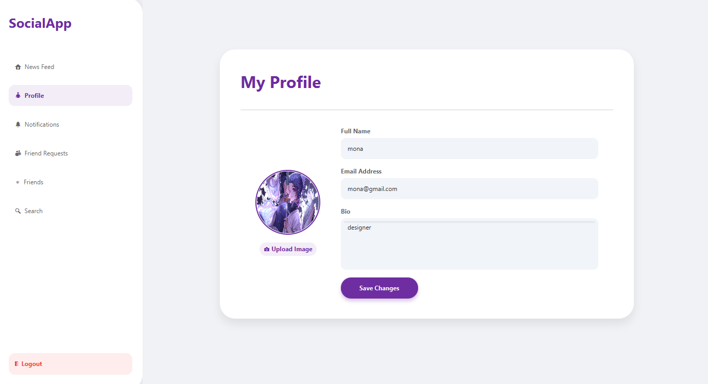

# 📱 Social Media App (JavaFX)

تطبيق تواصل اجتماعي متكامل يعتمد على هيكلية **MVC** ونمط **DAO** للتعامل مع البيانات. يوفر تجربة مستخدم سلسة لإدارة الأصدقاء والمنشورات.

---

## 🚀 المميزات الأساسية (Core Features)

* **إدارة الأصدقاء الذكية:** نظام إرسال واستقبال طلبات الصداقة مع منطق برمجى يمنع ظهور اسم المستخدم لنفسه في القائمة.
* **قاعدة بيانات MySQL:** هيكلة بيانات منظمة تشمل جداول المستخدمين والعلاقات بين الأصدقاء.
* **واجهة مستخدم عصرية:** تصميم واجهات باستخدام JavaFX و FXML مع نظام قائمة جانبية (Sidebar) للتنقل.
* **عرض الملفات الشخصية:** إمكانية عرض بروفايل الأصدقاء والتفاعل معهم.

---

## 📸 لقطات من التطبيق (Screenshots)

|    قائمة الأصدقاء (My Friends)    | واجهة البروفايل (Profile View) |
|:---------------------------------:| :---: |
|  |  |

> **ملاحظة:** تأكد من وجود الصور في مسار `ui/` داخل المشروع لتظهر بشكل صحيح.

---

## 🛠️ هيكلة قاعدة البيانات (Database Schema)

يعتمد المشروع على نظام علاقات (Relational DB) لربط المستخدمين ببعضهم:

* **جدول المستخدمين (Users):** يحتوي على البيانات الأساسية مثل `name`, `email`, و `password`.
* **جدول الأصدقاء (Friends):** يدير علاقات الصداقة عبر `user1_id` و `user2_id` مع تسجيل وقت تكوين الصداقة `created_at`.

---

## 💻 التقنيات المستخدمة (Tech Stack)

* **اللغة:** Java 17+
* **واجهة المستخدم:** JavaFX (FXML)
* **قاعدة البيانات:** MySQL 8.0
* **إدارة المشروع:** Git & GitHub

---

## ⚙️ كيفية التشغيل (Quick Start)

1. قم بإنشاء قاعدة البيانات باستخدام ملف الـ SQL المرفق.
2. تأكد من إعداد مكتبات JavaFX في الـ IDE الخاص بك (IntelliJ/Eclipse).
3. قم بتعديل بيانات الـ `DatabaseConnection` لتناسب جهازك.
4. قم بتشغيل الكلاس الأساسي `App.java`.

---

